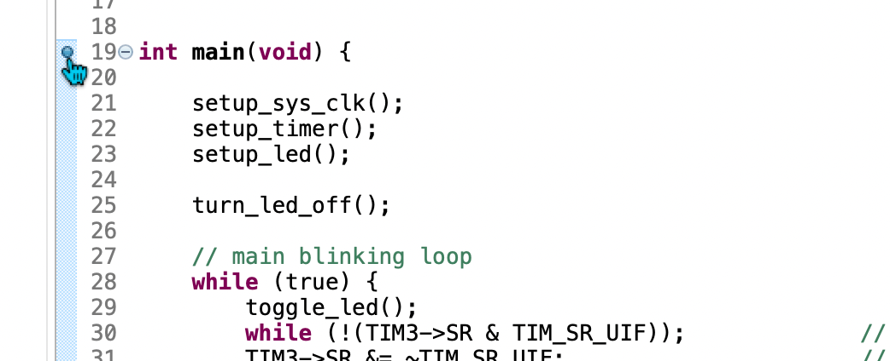
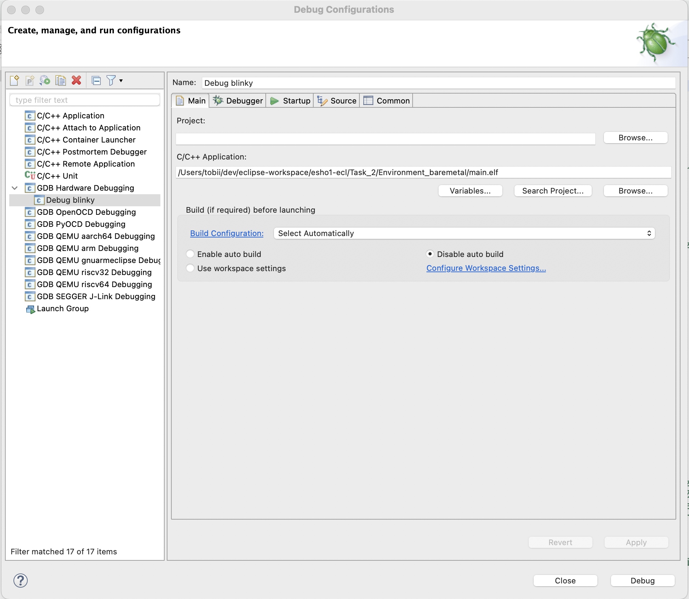
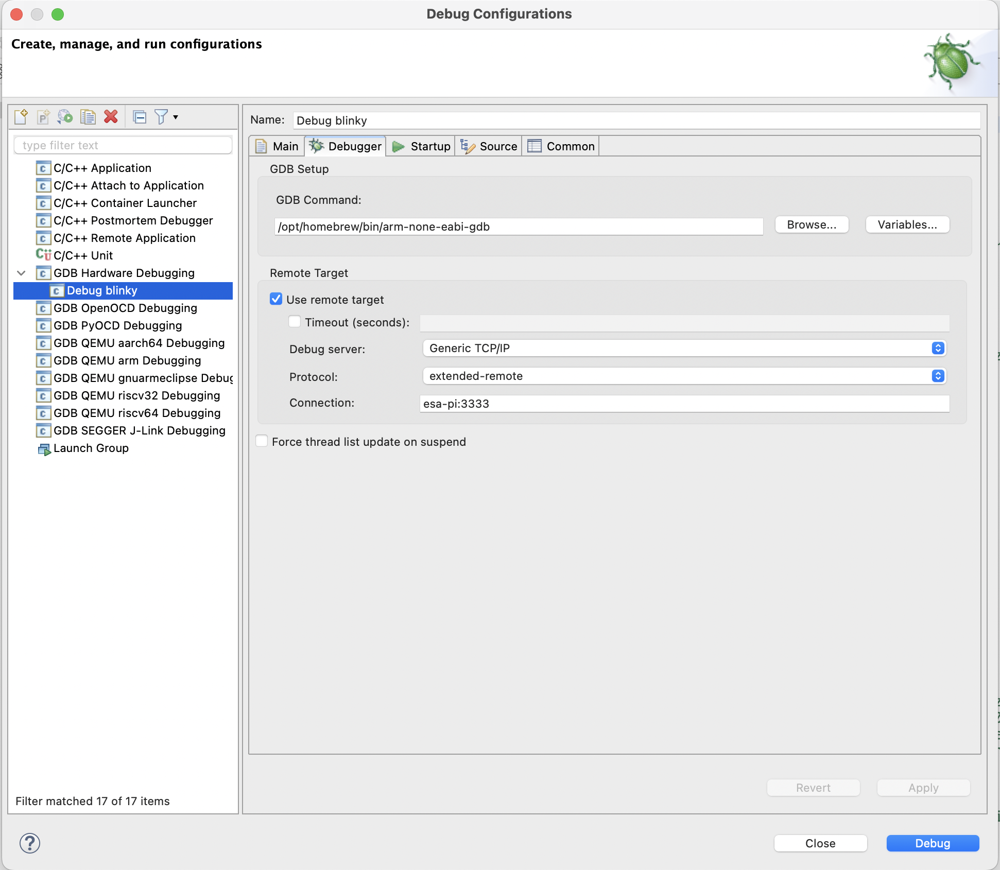
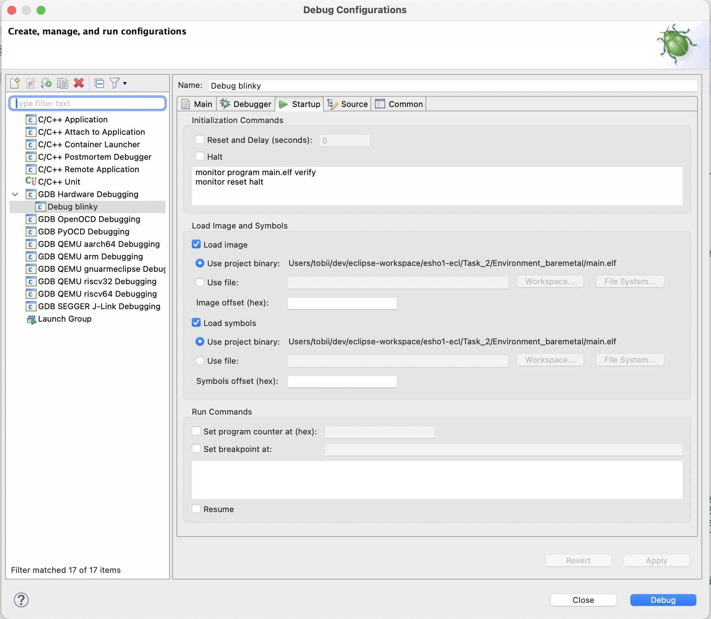
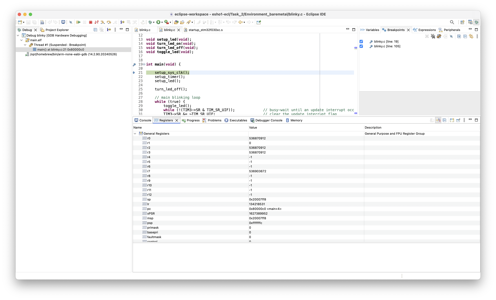
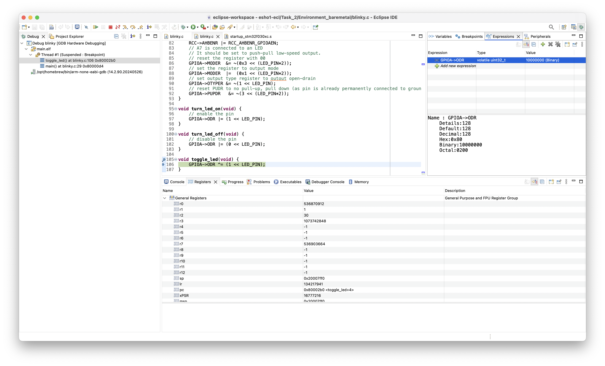

# Documentation of Task 03

## Task 3.1

SWD uses two pins: The SWCLK pin represents the clock while the SWD pin represents the data pin.
Both pins are mapped to GPIO pins.

SWD can be split into three phases

Connection setup:
This phase consists of a lineReset where the SWD is written with 1s more than 50 times.
After that the JTAG sequence is transmitted.
After this another lineReset follows.

Send phase:
Sending data via SWD is done in three steps. First the header bits are transmitted containing addresses and parities.
Next an acknowledgement is read. Last a data word sized 32 bits is transmitted with a parity bit.

Read phase:
Read data via SWD is also done in three steps. First the header bits are transmitted containing addresses and parities.
Next an acknowledgement is read. Last a data word sized 32 bits is read with a parity bit.

Sources:
-  google: Programming Internal Flash Over the Serial Wire Debug Interface: https://www.silabs.com/documents/public/application-notes/an0062.pdf

## Task 3.2 

Note: As a quick introduction to debugging with OpenOCD, [this short video](https://www.youtube.com/watch?v=_1u7IOnivnM) might be helpful.

### Software preparations

On our host PC, we need to install `arm-none-eabi-gcc` and `arm-none-eabi-gdb`.

On MacOS, these can easily installed with `brew install gcc-arm-embedded`.

On Debian-based Linux distros, `arm-none-eabi-gcc` can be installed with `apt install gcc-arm-none-eabi`. Instead of `arm-none-eabi-gdb`, you can use [`gdb-multiarch`](https://packages.debian.org/de/sid/gdb-multiarch) or download an old version, as described here:

- Download gcc-arm-none-eabi-10.3-2021.10-x86_64-linux.tar.bz2 from https://developer.arm.com/downloads/-/gnu-rm
- Extract via sudo tar xjf gcc-arm-none-eabi-10.3-2021.10-x86_64-linux.tar.bz2
- Execute ./arm-none-eabi-gdb ( found in bin )

### Start the GDB Server on the Raspberry Pi

Start OpenOCD on the Raspberry Pi by running:
  ```
  openocd -f Task_1/stm32f0raspberry.cfg
  
  Result:
  Open On-Chip Debugger 0.12.0-01004-g9ea7f3d64 (2024-05-08-19:50)
  Licensed under GNU GPL v2
  For bug reports, read
        http://openocd.org/doc/doxygen/bugs.html
  Info : BCM2835 GPIO JTAG/SWD bitbang driver
  Info : clock speed 1006 kHz
  Info : SWD DPIDR 0x0bb11477
  Info : [stm32f0x.cpu] Cortex-M0 r0p0 processor detected
  Info : [stm32f0x.cpu] target has 4 breakpoints, 2 watchpoints
  Info : starting gdb server for stm32f0x.cpu on 3333
  Info : Listening on port 3333 for gdb connections
      TargetName         Type       Endian TapName            State       
  --  ------------------ ---------- ------ ------------------ ------------
  0* stm32f0x.cpu       cortex_m   little stm32f0x.cpu       running

  Info : Listening on port 6666 for tcl connections
  Info : Listening on port 4444 for telnet connections
  ```
So OpenOCD has now started a GDB Server on port 3333 of the Raspberry Pi.

### Debug Session

On our host PC, we `cd` into `Task_2/Environment_baremetal`. In the following, we want to debug `blinky.c`:

- To do that, we first compile our program
```
➜ tobii@MacBook-Pro-von-Tobias:~/.../Task_2/Environment_baremetal$ make CSRC=blinky.c
arm-none-eabi-gcc -I../../utils/STM32CubeF0/Drivers/CMSIS/Include -I../../utils/STM32CubeF0/Drivers/CMSIS/Device/ST/STM32F0xx/Include -mlittle-endian -mcpu=cortex-m0 -mthumb -mfloat-abi=soft -g3 -c blinky.c -o build/blinky.o
arm-none-eabi-gcc -I../../utils/STM32CubeF0/Drivers/CMSIS/Include -I../../utils/STM32CubeF0/Drivers/CMSIS/Device/ST/STM32F0xx/Include -mlittle-endian -mcpu=cortex-m0 -mthumb -mfloat-abi=soft -g3 -c startup_stm32f030xc.s -o build/startup_stm32f030xc.o
arm-none-eabi-gcc -mlittle-endian -mcpu=cortex-m0 -mthumb -mfloat-abi=soft -g3 -TSTM32F030xC_FLASH.ld -nostartfiles -nostdlib -o main.elf  build/blinky.o  build/startup_stm32f030xc.o
```

- We then start `arm-none-eabi-gdb` and connect to the target (i.e. our M0 processor) using `target extended-remote tcp:hostIP:port`
```
➜ tobii@MacBook-Pro-von-Tobias:~/.../Task_2/Environment_baremetal$ arm-none-eabi-gdb main.elf 
GNU gdb (Arm GNU Toolchain 13.2.rel1 (Build arm-13.7)) 13.2.90.20231008-git
Copyright (C) 2023 Free Software Foundation, Inc.
License GPLv3+: GNU GPL version 3 or later <http://gnu.org/licenses/gpl.html>
This is free software: you are free to change and redistribute it.
There is NO WARRANTY, to the extent permitted by law.
Type "show copying" and "show warranty" for details.
This GDB was configured as "--host=aarch64-apple-darwin20.6.0 --target=arm-none-eabi".
Type "show configuration" for configuration details.
For bug reporting instructions, please see:
<https://bugs.linaro.org/>.
Find the GDB manual and other documentation resources online at:
    <http://www.gnu.org/software/gdb/documentation/>.

For help, type "help".
Type "apropos word" to search for commands related to "word"...
Reading symbols from main.elf...
(gdb) target extended-remote tcp:192.168.2.2:3333
Remote debugging using tcp:192.168.2.2:3333
0x08000ab4 in ?? ()
```

- Load the compiled program onto our M0. This is just an alternative to using the flash command of OpenOCD.
```
(gdb) load
Loading section .isr_vector, size 0xbc lma 0x8000000
Loading section .text, size 0x29c lma 0x80000bc
Start address 0x080002dc, load size 856
Transfer rate: 2 KB/sec, 428 bytes/write.
```

- Reset the target and read the M0's registers
```
(gdb) monitor reset halt
[stm32f0x.cpu] halted due to debug-request, current mode: Thread 
xPSR: 0xc1000000 pc: 0x080002dc msp: 0x20008000
(gdb) info reg
r0             0xffffffff          -1
r1             0xffffffff          -1
r2             0xffffffff          -1
r3             0xffffffff          -1
r4             0xffffffff          -1
r5             0xffffffff          -1
r6             0xffffffff          -1
r7             0xffffffff          -1
r8             0xffffffff          -1
r9             0xffffffff          -1
r10            0xffffffff          -1
r11            0xffffffff          -1
r12            0xffffffff          -1
sp             0x20008000          0x20008000
lr             0xffffffff          -1
pc             0x80002dc           0x80002dc <Reset_Handler>
xPSR           0xc1000000          -1056964608
msp            0x20008000          0x20008000
psp            0xfffffffc          0xfffffffc
primask        0x0                 0
basepri        0x0                 0
faultmask      0x0                 0
control        0x0                 0
```

- Create a breakpoint at the beginning of main and let the M0 run up to this breakpoint. Read out the registers again.
```
(gdb) break main
Breakpoint 1 at 0x80000c0: file blinky.c, line 21.
Note: automatically using hardware breakpoints for read-only addresses.
(gdb) c
Continuing.

Breakpoint 1, main () at blinky.c:21
21          setup_sys_clk();
(gdb) info reg
r0             0x20000000          536870912
r1             0x0                 0
r2             0x20000000          536870912
r3             0x20000000          536870912
r4             0xffffffff          -1
r5             0xffffffff          -1
r6             0xffffffff          -1
r7             0x20007ff8          536903672
r8             0xffffffff          -1
r9             0xffffffff          -1
r10            0xffffffff          -1
r11            0xffffffff          -1
r12            0xffffffff          -1
sp             0x20007ff8          0x20007ff8
lr             0x8000323           134218531
pc             0x80000c0           0x80000c0 <main+4>
xPSR           0x61000000          1627389952
msp            0x20007ff8          0x20007ff8
psp            0xfffffffc          0xfffffffc
primask        0x0                 0
basepri        0x0                 0
faultmask      0x0                 0
control        0x0                 0
```

- Set a breakpoint at the beginning of `toggle_led()`. We can then run our program until this breakpoint is being hit by typing `continue` (or the `c` shortcut). This way, every time we enter `c`, our LED gets toggled.
```
(gdb) break toggle_led
Breakpoint 2 at 0x80002b0: file blinky.c, line 106.
(gdb) c
Continuing.

Breakpoint 2, toggle_led () at blinky.c:106
106         GPIOA->ODR ^= (1 << LED_PIN);
(gdb) c
Continuing.

Breakpoint 2, toggle_led () at blinky.c:106
106         GPIOA->ODR ^= (1 << LED_PIN);
(gdb) c
Continuing.

Breakpoint 2, toggle_led () at blinky.c:106
106         GPIOA->ODR ^= (1 << LED_PIN);

[...]

(gdb)
```

- We want to examine the toggling of the LED more closely:
  - Currently, our LED is turned off.  
  - Using the examine command (`x`), let's read `1` word (`w`) at address `0x48000014` and display the contents in binary format (`t`). `0x48000014` is the address of the GPIOA_ODR register, as we know from the M0 reference manual.  
  - This yields in `00000000000000000000000000000000`, which makes sense because our LED is off.  
  - After entering `next`, the next statement of `toggle_led()` is executed and the LED turns on. 
  - If we repeat our examine command, we now get `00000000000000000000000010000000` so the 7-th bit is now `1`, which makes sense because our LED is connected to the 7-th pin on port A. [More information on the examine command here](https://www-zeuthen.desy.de/dv/documentation/unixguide/infohtml/gdb/Memory.html).
```
(gdb) frame
#0  toggle_led () at blinky.c:106
106         GPIOA->ODR ^= (1 << LED_PIN);
(gdb) x/1tw 0x48000014
0x48000014:     00000000000000000000000000000000
(gdb) next
107     }
(gdb) x/1tw 0x48000014
0x48000014:     00000000000000000000000010000000
```

Messing with gdb has resulted in some additional log messages at OpenOCD on the Raspberry Pi:
```
Info : accepting 'gdb' connection on tcp/3333
Info : device id = 0x10006442
Info : flash size = 256 KiB
undefined debug reason 8 - target needs reset
[stm32f0x.cpu] halted due to debug-request, current mode: Thread 
xPSR: 0xc1000000 pc: 0x08000ab4 msp: 0x20008000
[stm32f0x.cpu] halted due to debug-request, current mode: Thread 
xPSR: 0xc1000000 pc: 0x080002dc msp: 0x20008000
[stm32f0x.cpu] halted due to debug-request, current mode: Thread 
xPSR: 0xc1000000 pc: 0x080002dc msp: 0x20008000
```

## Task 3.3

### Software preparations

Install Eclipse on the host PC:
- Download the [Eclipse Installer](https://www.eclipse.org/downloads/packages/installer)

- Extract the installer
  ```bash
  tar -xf eclipse-inst-jre-linux64.tar.gz
  ```

- Run the installer 
  ```bash
  ./eclipse-inst
  ```
- Within the Eclipse Installer, select "Eclipse IDE for Embedded C/C++ Developers"

### Open our project within Eclipse

We now open our ESHO1 project from git within Eclipse as a general project, which seems to be the best way to get it working there. To do that, follow these steps:

- Open Eclipse and close the Welcome dialogue
- Click "File" → "Import"
- Select "Projects from Git"
- Select "Clone URI" and enter `gitlab:ESHO1_24/Group07` as the URI
- At the Branch Selection, just click "Next"
- For the destination, create a new folder within the current Eclipse workspace and make sure to check "Clone submodules"
- Select "Import as general project" and hit "Finish"

We can now explore our whole ESHO1 project. Open `Task_2/Environment_baremetal/blinky.c`, which is the file we will be debugging.

### Compilation

As our project structure of Task 2 does not really seam to fit to what Eclipse expects, we figure the easiest way to compile our program is just to do it manually:

- Open a Terminal by pressing `Ctrl` + `Shift` + `T` and enter
```
make CSRC=blinky.c
```

Note: Eclipse's Project Explorer does not refresh automatically. To Refresh, select the current project and hit `F5`.

We can then copy the compiled program onto our Raspberry Pi:
```
scp main.elf <Raspberry Pi's IP Address>:/home/<Raspberry Pi's Username>/
```

### Debugging Session

- Start OpenOCD on the Raspberry Pi from the home directory:
```
openocd -f esho1/Task_1/stm32f0raspberry.cfg 
```

- Create Breakpoints at `main()` and at `toggle_led()` by double-clicking
  

- Click "Run" → "Debug Configurations" and create a new "GDB Hardware Debugging" configuration:
  - Select the `main.elf` file and disable auto build
  
  - Specify the full path to the debugger, select `Generic TCP/IP`, `extended-remote` and specify the hostname (or IP address) of the Raspberry Pi and the port `3333`
  
  - Enter the Initialization Commands as shown and make sure that "Load image" and "Load symbols" are ticked

  - No Changes to "Source" and "Common" are neccessary

- Click "Debug" and switch to "Debug View"

- After hitting "Resume" (F8), the execution stops at the beginning of `main()`. We can examine the registers with the "Registers" tab:


- After that, just like in 3.2, every time we hit "Resume", the LED gets toggled

- To examine the state of the GPIOA_ODR register, we can add a watch expression: Right-click anywhere on the code tab and select "Add Watch Expression...", then enter `GPIOA->ODR`. Now, every time we resume, we can see the value of the register change between `0b0` and `0b10000000`.
