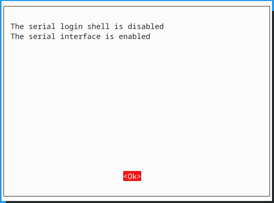

# Task 4

## 4.1 Bettery blinky with HAL

## 4.2 UART

To use UART, we need to enable it first

- open the raspberry pi config with: `sudo raspi-config` 

- select `3. Interace options`

- select `Serial Port`

- It will ask you two questions. 
  
  1. `Would you like a login shell to be accessible over serial?` -> select `No` 
  
  2. `Would you like the serial port hardware to be enabled?` -> select `Yes`

. You should see the following message:

  . 

- select `OK`

- select `finish and reboot`

The involved GPIO pins on the raspberry pi for the UART communication are

- 15 (rx = receive)

- 14 (tx = trasmit)

On our extension board they are connected to USART 5 on the M0

On the raspberry pi we can now select `/dev/serial0` as UART port. 

**Note:**  `/dev/serial0` is a symbolic link to `/dev/ttyS0`

[For more information see the offical documentation]([Configuration - Raspberry Pi Documentation](https://www.raspberrypi.com/documentation/computers/configuration.html#configure-uarts))

### Side note about USART vs UART

**UART** stands for **U**niversal **A**synchronous **R**eceiver **T**ransmitter whereas the **USART** stands for **U**niversal **S**ynchronous **A**synchronous **R**eceiver **T**ransmitter.
 The term Synchronous enables the USART to send an additional clock 
signal to the receiving device. The data is then sampled at a predefined
 edge (Rising or Falling) of the clock. The USART mode uses **3 pins** (clock, Tx and Rx) compared to the **2 pins** (Tx and Rx) used in the UART. [Source 26.6.24](https://controllerstech.com/stm32-uart-1-configure-uart-transmit-data/)
