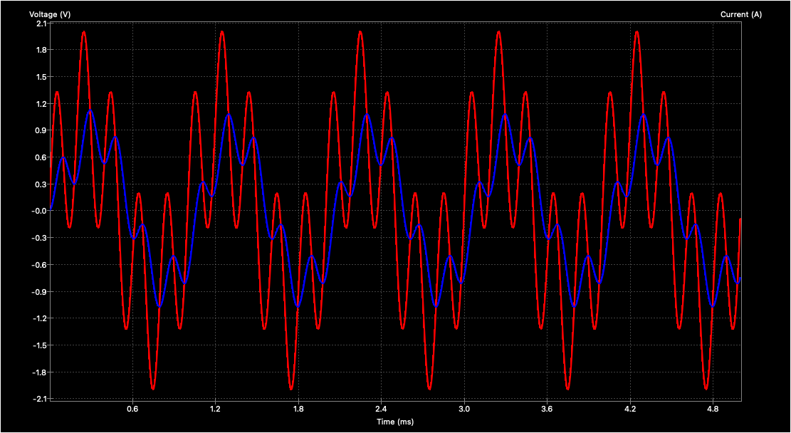
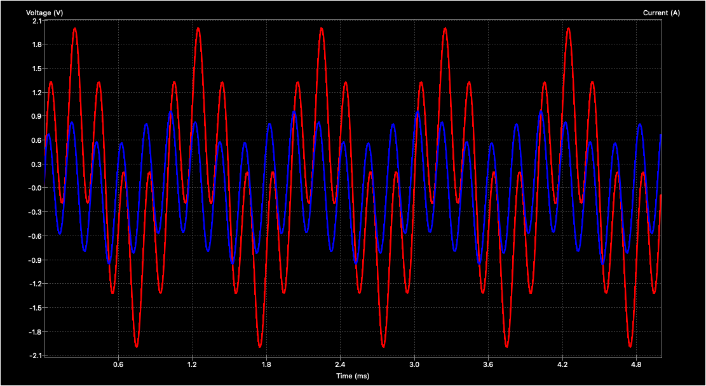

# Documentation of Task 05
_Further files of this task: See `Task_5/`_.

## 5.1 Simulation of Analog Filters

**Simulation schematic**:  
Open 1_Simulation_of_Analog_Filters/Filters/Filters.kicad_sch with KiCad

**Resistor and Capacitor values**:  
Given:
- f_LP = 1500Hz
- f_HP = 4500Hz
- L = 0.1

Calculated:
- R_HP = 2\*pi\*L\*f_HP = 900pi Ohm = 2827.43 Ohm
- C_HP = 1/(2\*pi\*R_HP\*f_HP) = 1/(8100000pi²) Farad = 1.25088e-8 Farad ≈ 12.5 nF
- R_LP = 2\*pi\*L\*f_LP = 300pi Ohm = 942.48 Ohm
- C_LP = 1/(2\*pi\*R_LP\*f_LP) = 1/(900000pi²) Farad  = 1.12579e-7 Farad ≈ 112.5 nF
      

We used the following parameters for our simulations: {500Hz, 1500Hz, 2500Hz, 3500Hz, 4500Hz, 6500Hz, 8500Hz}.

**Transient simulation**:  
View 1_Simulation_of_Analog_Filters/Simulation/Transient Simulation/LinearTransient*  

General: Input signal in red, Output signal in blue

The input signal is the combination of a 1kHz sinus wave and a 5kHz sinus wave.

As expected the high pass filter both with capacitor and with coil lead to an identical output signal using the computed values. The same holds true for the low pass filter. As the resulting plots are bit-wise identical, we do not provide different plots for RL_HP and RC_HP or RL_LP and RC_LP.

With a cutoff frequency of 1500 Hz, the low pass filter dampens the 5kHz signal and lets the 1kHz signal through:


With a cutoff frequency of 4500 Hz, the high pass filter dampens the 1kHz signal and lets the 5kHz signal through:

      
In both cases the dampening is not complete and remains of the dampened sinus wave are visible.

If we decrease the cutoff frequency of the low pass filter, the resulting signal contains less disturbance but the amplitude is lower, because the low frequencies get attenuated more. As expected, the low-pass filter has less and less influence on the input signal as the cutoff frequency is increased.

Increasing the cut-off frequency of the high-pass filter results in a lower amplitude of the output signal. If the cutoff frequency is reduced, the disturbances in the output signal increase until it is almost identical to the input signal again.

**Frequency response simulation**: 

We generated plots with all combinations of cut-off frequencies for high and low pass filters:

f_span = {500Hz, 1500Hz, 2500Hz, 3500Hz, 4500Hz, 6500Hz, 8500Hz}

LP x HP = f_span x f_span

View 1_Simulation_of_Analog_Filters/Simulation/Frequency Response Simulation/LinearAC_fLP${f_span}_fHP${f_span}.png. 

The frequency response diagram shows the effect of the high and low pass filter (high pass: blue, low pass: orange). It varies according to the cut-off frequencies.

As expected, a higher cut-off frequency for the high-pass filter leads to a stronger attenuation of lower frequencies. With the low-pass filter, it is the other way around - as the cut-off frequency increases, lower frequencies are allowed through more and more.

**Phase Shift**:

View 1_Simulation_of_Analog_Filters/Simulation/Phase Shift Simulation/*.png

We can observe that the more the filters influence the output signal, the greater the phase shift. Specifically, the phase shift is highest for low-pass filters with low cut-off frequencies and for high-pass filters with high cut-off frequencies.
The phase shift is always negative for the low-pass filter and positive for the high-pass filter.

**Damping of all filters at 1kHz and 5kHz**:

Calculated using 1_Simulation_of_Analog_Filters/DampingComputation.py:

```
High-Pass Filter
High-pass gain formula: 1/(sqrt(1+(1/(2*pi*C*R)²)))
Frequency: 1000   Cut-off Frequency:  500   Damping: -0.97 dB
Frequency: 1000   Cut-off Frequency: 1500   Damping: -5.12 dB
Frequency: 1000   Cut-off Frequency: 2500   Damping: -8.60 dB
Frequency: 1000   Cut-off Frequency: 3500   Damping: -11.22 dB
Frequency: 1000   Cut-off Frequency: 4500   Damping: -13.27 dB
Frequency: 1000   Cut-off Frequency: 6500   Damping: -16.36 dB
Frequency: 1000   Cut-off Frequency: 8500   Damping: -18.65 dB
Frequency: 5000   Cut-off Frequency:  500   Damping: -0.04 dB
Frequency: 5000   Cut-off Frequency: 1500   Damping: -0.37 dB
Frequency: 5000   Cut-off Frequency: 2500   Damping: -0.97 dB
Frequency: 5000   Cut-off Frequency: 3500   Damping: -1.73 dB
Frequency: 5000   Cut-off Frequency: 4500   Damping: -2.58 dB
Frequency: 5000   Cut-off Frequency: 6500   Damping: -4.30 dB
Frequency: 5000   Cut-off Frequency: 8500   Damping: -5.90 dB


Low-Pass Filter
Low-pass gain formula: 1/(sqrt(1+(2*pi*C*R)²))
Frequency: 1000   Cut-off Frequency:  500   Damping: -6.99 dB
Frequency: 1000   Cut-off Frequency: 1500   Damping: -1.60 dB
Frequency: 1000   Cut-off Frequency: 2500   Damping: -0.64 dB
Frequency: 1000   Cut-off Frequency: 3500   Damping: -0.34 dB
Frequency: 1000   Cut-off Frequency: 4500   Damping: -0.21 dB
Frequency: 1000   Cut-off Frequency: 6500   Damping: -0.10 dB
Frequency: 1000   Cut-off Frequency: 8500   Damping: -0.06 dB
Frequency: 5000   Cut-off Frequency:  500   Damping: -20.04 dB
Frequency: 5000   Cut-off Frequency: 1500   Damping: -10.83 dB
Frequency: 5000   Cut-off Frequency: 2500   Damping: -6.99 dB
Frequency: 5000   Cut-off Frequency: 3500   Damping: -4.83 dB
Frequency: 5000   Cut-off Frequency: 4500   Damping: -3.49 dB
Frequency: 5000   Cut-off Frequency: 6500   Damping: -2.02 dB
Frequency: 5000   Cut-off Frequency: 8500   Damping: -1.29 dB
```

## 5.2 Measurement of Analog Filters

**Screenshots from the oscilloscope
- Waveform of unfiltered and filtered noise signal : 
Waveform_1msSpan_LowPassCoil.png
Waveform_2msSpan_LowPassCoil.png
Waveform_1msSpan_LowPassCap.png
Waveform_2msSpan_LowPassCap.png
- FFT of unfiltered and filtered noise signal : 
FFT_Filtered_LowPassCoil.png
FFT_Filtered_LowPassCap.png
- Waveform of unfiltered and filtered sine signal : 
Sinus_LowPassCoil.png
Sinus_LowPassCap.png

**Diagrams fro frequency response and filtered signals
- Waveform of unfiltered and filtered sine signal : 
WhiteNoiseSignal_LowPassCoil_600K.png
WhiteNoiseSignal_LowPassCoil_6M.png
WhiteNoiseSignal_LowPassCap_600K.png

**Comparison between measured and simulated behavior of signals
The FFT diagrams of the previous subtask are similar enough so that we just focus on FFT_LowPassCoil_6M. This data section has the most prevision. We already found out in 5.1 that the Low pass filter using a coil and a capacitor performs identical.
Looking at FFT_LowPassCoil_6M.png shows a FFT that is not smooth at all. One can see a low-pass behavior but using the graph alone one would guess the cut off to be between 500Hz and 2000Hz.
To improve the visbility we smooth the FFT diagram with a Savgol filter using polynomials or order 5 and 30 basis points. This results in the diagram visible in FFT_LowPassCoil_6M_smoothed.png. The diagram is clearer and the cut off frequency can be recognized if already known to be at 1500Hz.

**Summary of the measurement procedure and the results in a structured document
See MeasurementProtocol.pdf


## 5.3 Simulation of Digital Filters

**Frequency response of FIR filters**:
View 3_Simulation_of_Digital_Filters/*.png for Frequency response and the Matlab tool settings

**Filter coefficients of Nuttal-FIR filters**:
View 3_Simulation_of_Digital_Filters/*.fcf for filter coefficients of the different filters

**Filter coefficients of KaiserWindow-FIR filters**:
View 3_Simulation_of_Digital_Filters/KaiserWindow_Optim.fcf for filter coefficients and the order of the filter
View 3_Simulation_of_Digital_Filters/KaiserWindow_Optim.png for Frequency response
View 3_Simulation_of_Digital_Filters/KaiserWindow_Optim_Settings.png for Matlab tool settings

**Nuttal-FIR filter vs Task 5.1 Lowpass@1.5kHz**:
For N=5 and N=10 the analouge filter is the steeper one. Only N=20 leads to a digital Nuttal filter with a steeper amplitude response. This can be seen by comparing the values at f=2kHz. The analoge filter has a -12dB damping at that point while the Nuttal filter for N=5 and N=10 has a damping of > -10dB.

**Nuttal-FIR filter N=10 vs Rectangular N=10**:
Rectangular is steeper between 1.5kHz and 2kHz but has a lower damping above 2kHz, staying above -30dB for large frequency bands.

**Nuttal-FIR filter N=20 vs Kaiser Window**:
The Nuttal window N=20 filter drops to a much higher damping at high frequencies. Between 1.5kHz and 3kHz the Nuttal window filter is steeper.

## 5.4 Realization of Digital Filters
**FIR implementation**:
The FIR Filter is implemented in the Header "FIRFilter.h"

**FIR filter design**:
Reading frequency on the microcontroller and the filter design interact with each other.
A larger filter leads to a lower sampling frequency and a lower frequency allows a smaller filter.
We choose a sampling frequency of 50Hz as a compromise.
There are no large amplitudes in the accelerometer above 10Hz. As a result we choose 20Hz as our upper pass frequency.
The lower pass frequency is chosen to be 0.2 Hz. This is a compromise. Lower values lead to a larger filter that does not fit on the microcontroller. Any signals with a period of more than 5s is damped as a result.
FilterDesignAnalysis/BandpassFilterDesign.png shows the design parameters
FilterDesignAnalysis/BandpassAmplitudeDesigner.png shows the resulting amplitudes above the frequencies.

**FIR filter evaluation**:
FilterDesignAnalysis/TransientPlot*.png show the plotted data track with the filtered and unfiltered signal.
More detailed insights into the data track can be gained by using the FilterDesignAnalysis/postProcessingAcceleration.py script in combination with the data file FilterDesignAnalysis/AccelerationDataTrack.csv
FilterDesignAnalysis/FFTPlot*.png show the effect of the filter on the amplitudes measured my the accelerometer. Our filter is effectively able to dampen low frequencies below 0.2Hz. The static gravity is dampened away.
The intermediate frequencies are kept.
This proofs that our filter design was successful.

## 5.5 Choice of Filter Implementation

Advantage analog filter:
- Can be implemented cheaply with electric components without the need for computation power
- No complication by the necessity to pay attention to the digital frequency
- No additional components necessary to bridge the analogue to digital gap

Advantage digital filter:
- Can be implemented by software and therefore easily changed
- Easy implementation of high order filters only limited by memory consumption
- Components can not change their values due to age
