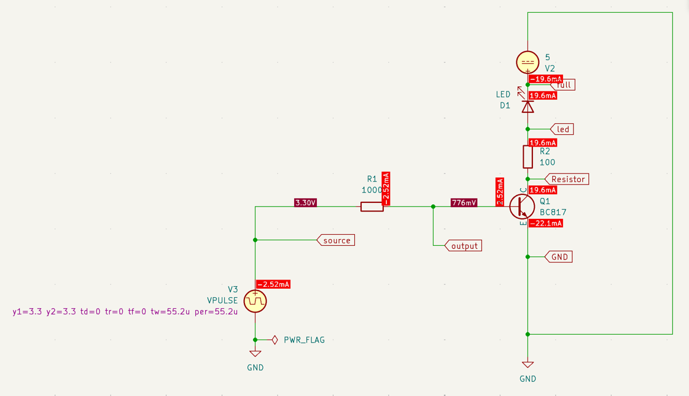
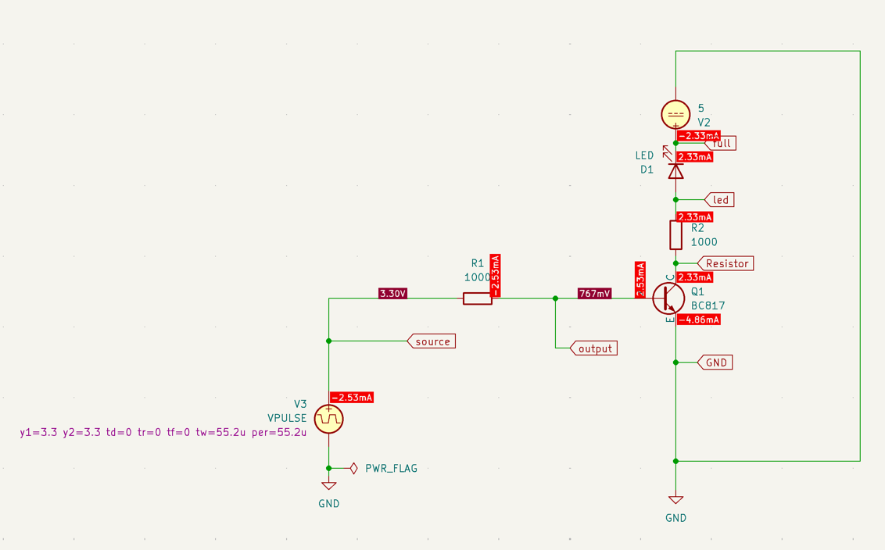
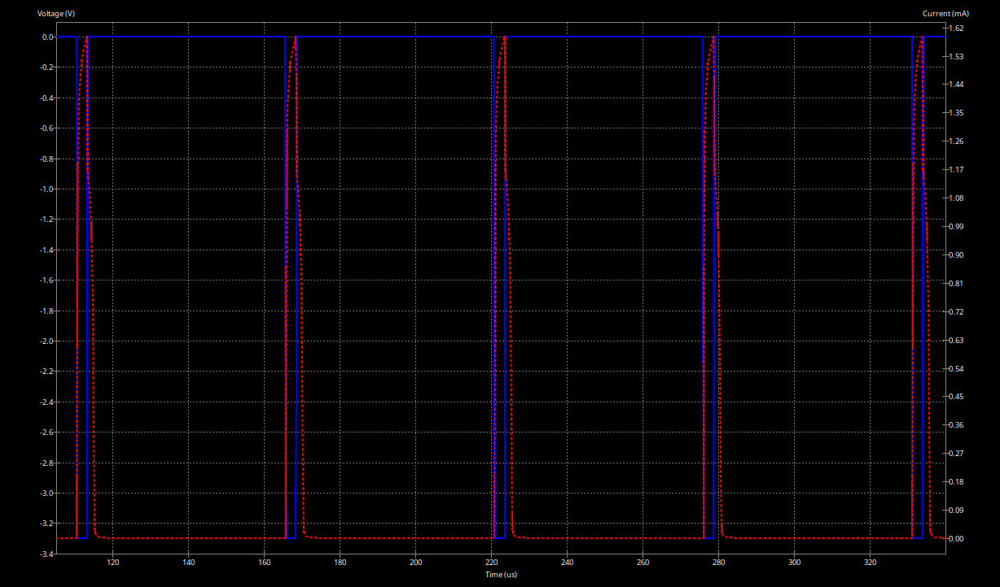
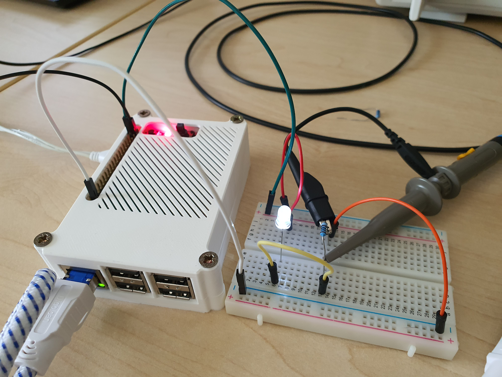

# Documentation of Task 06
_Further files of this task: See `Task_6/`_.

## 6.1 Dimming a LED by PWM

### Short explanation of the schematic
Circuit with 5V voltage source V2, the LED, a resistor R2, which limits the current through the LED, and a transistor. We use the transistor as a switch. When the voltage source V3 activates the circuit the transistor "switches" on and the LED lights up.

A small base current to the BJT results in a larger collector current. The relationship between those two currents is called the DC current gain (hFE). The DC current gain depends in particular on the temperature and collector current and, according to the [data sheet](https://assets.nexperia.com/documents/data-sheet/BC817_SER.pdf) for the BC817-25, ranges from 160 to 400 at an ambient temperature of 25 °C and a collector current of 100 mA and a Collecter-to-Emitter voltage of 1 V.

### Simulation

The simulated circuit is located at 1_Dimming_a_LED_by_PWM/Dimming_simulation.

Note: For the simulations to produce reasonable results, we had to change the polarity of the LED (or flip the voltage sources, alternatively) for some reason. We figure this might be due to a bug with the BC817 model.

#### Determining the Resistor Value for the LED
We performed an OP simulation to simulate the current flow through the LED.

The minimum resistance value seems to be about 100 Ohms, which leads to a simulated current flow of 19.6 mA:

In this case, the relationship between base current and collector current is 19.6 / 2.52 ≈ 7.78

As this value is very close to the LED's limits, we figured a resistance value of 1000 Ohms would also be enough to light up the LED. In this case, only 2.33 mA flow through the LED:

The relationship between base current and collector current is 2.33 / 2.53 ≈ 0.92.

#### PWM Simulation

see all images in `images/SimulationPWM_*_100Ohm_VoltageLED_CurrentR2.png`

*Example with 005perc: SimulationPWM_005perc_100Ohm_VoltageLED_CurrentR2*

See all images in `images/SimulationPWM_*_1000Ohm_VoltageLED_CurrentR2.png`

*Example with 005perc: SimulationPWM_005perc_1000Ohm_VoltageLED_CurrentR2*

### PWM Code

Within `1_Dimming_a_LED_by_PWM/Dimming_LED_pwm_code/` you'll find the code we used to perform the measurements in the Lab:

the code uses two timer `tim1` and `tim3` to control both the onboard LED_1 and an external LED (connected to `M4` / `PA9`)

Our software has three LED modes: 
1. manually: use the joystick left and right to increase and decrease the brightness of the led
2. Auto-triangle mode: the LED increase and decreases the brightness with a triangle function
3. Heartbeat mode: the LED simulates a (human like) heatbeat

use the joystick up or down to iterate between the modes

To perform lab testings, set the `lab_mode` in main.cpp to true.

Both programs use a PWM frequency of 24 kHz. The duty cycle is initially set to 100 % and can be adjusted via the debugger, as described in main.cpp.


### Measurements in Lab

Implementation of the circuit on a breadboard and measurement setup:


#### Voltage over LED with different duty cycles

see all images in `images/VoltageLED_100Ohm_*.png`

*Example for 005perc: VoltageLED_1000Ohm_005perc*

see all images in `images/VoltageLED_1000Ohm_*.png`

*Example with 005pers: VoltageLED_100Ohm_005perc*

The simulated base voltage (from above) was made to fit the measured one. Obviously the simulated voltage is cleaner than the measured voltage.

#### Current through LED

As no ampere meter was available in the lab, the current has to be derived from the measured voltage (cf. U ≈ 2.4 V at `images/VoltageLED_100Ohm_100perc.png` and U ≈ 2.6 V at`images/VoltageLED_100Ohm_1000perc.png`):

U = R * I => I = U / R

- R = 100 Ohms: I = 2.4 V / 100 Ohms = 24 mA
- R = 1000 Ohms: I = 2.6 V / 1000 Ohms = 2.6 mA

Both measured values are a little higher than the simulated ones. Although the LED can withstand a maximum current flow of 25 mA according to the data sheet, we therefore carried out the majority of our measurements with a resistance of 1000 ohms for safety reasons so as not to damage the LED.

#### Voltage over the BJT (without LED) at 50% duty cycle

Cf. `images/VoltageRasPi_050perc.png`

### Improved brightness curve
The human eye does not have a linear brightness sensitivity but a nearly logarithmic one. The non-1linearity allows us to see in low light
situations like in moonlight (0.05-0.36lx) but also in full sunlight (130.000 lx) [Wikipedia](https://de.wikipedia.org/wiki/Beleuchtungsst%C3%A4rke).
We can also use a logarithmic scale to improve the brightness steps of our LED. We decided to use 100 steps, from 0 to 99, and calculate the current brightness with the formula:
As `brightness_basis` we decided based on empirical research to use `3.26` as this gives us the best results.

`pow(brightness_basis, log2(precision_pwm) * (new_brightness_step + 1) / number_of_steps) - 1;`

This results in the following brightness steps, which we use as a new pulse for PWM.
```
[0, 0, 0, 0, 0, 0, 1, 1, 1, 1, 1, 1, 1, 1, 1, 1, 1, 1, 1, 1, 2, 2, 2, 2, 2, 2, 2, 3, 3, 3,
3, 4, 4, 4, 5, 5, 5, 6, 6, 7, 7, 8, 8, 9, 10, 11, 11, 12, 13, 14, 15, 17, 18, 19, 21, 23,
24, 26, 29, 31, 33, 36, 39, 42, 45, 49, 53, 57, 61, 66, 72, 77, 84, 90, 97, 105, 114,
123, 132, 143, 154, 167, 180, 194, 210, 227, 245, 264, 286, 308, 333, 360, 388, 419, 453, 
489, 528, 570, 616, 665]
```

Previously we calculated the brightness steps linear with 
`new_brightness =  (new_brightness_step * 665);`
With brightness steps from 0 to 1 with 0.1 step size
