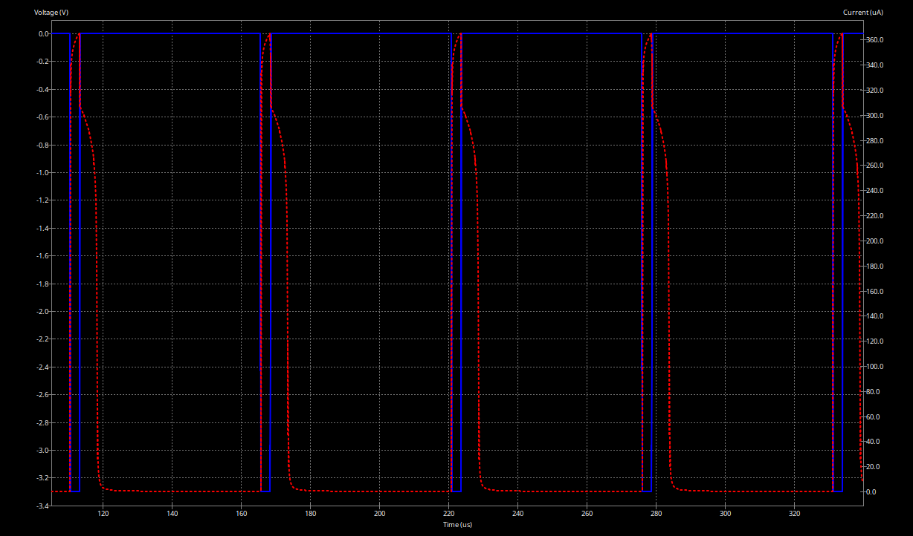

# Documentation of Task 06

## 5.1 Dimming a LED by PWM

### Short explanation of the schematic
Circuit with 5V voltage source V2, the LED, a resistor R2 and a transistor. When the voltage source V3 activates the circuit the LED lights up.

### Measurements in Lab

Within `1_Dimming_a_LED_by_PWM/Dimming_LED_pwm_code/` you'll find the code we used to perform the measurements in the Lab:

the code uses two timer `tim1` and `tim3` to control both the onboard LED_1 and an external LED (connected to `M4` / `PA9`)

Our software has three LED modes: 
1. manually: use the joystick left and right to increase and decrease the brightness of the led
2. Auto-triangle mode: the LED increase and decreases the brightness with a triangle function
3. Heartbeat mode: the LED simulates a (human like) heatbeat

use the joystick up or down to iterate between the modes

To perform lab testings, set the `lab_mode` in main.c to true.

Both programs use a PWM frequency of 24 kHz. The duty cycle is initially set to 100 % and can be adjusted via the debugger, as described in both main.c files.

### KiCad project and screenshots of the simulation results
see all images in `images/SimulationPWM_*_100Ohm_VoltageLED_CurrentR2.png` 

*Example with 005perc: SimulationPWM_005perc_100Ohm_VoltageLED_CurrentR2*

See all images in `images/SimulationPWM_*_1000Ohm_VoltageLED_CurrentR2.png`

*Example with 005perc: SimulationPWM_005perc_1000Ohm_VoltageLED_CurrentR2*

### Screenshots of measurements and comparison to simulated results
see all images in `images/VoltageLED_100Ohm_*.png` 

*Example for 005perc: VoltageLED_1000Ohm_005perc*

see all images in `images/VoltageLED_10Ohm_*.png`

*Example with 005pers: VoltageLED_100Ohm_005perc*

The simulated base voltage was made to fit the measured one. Obviously the simulated voltage is cleaner than the measured voltage.

### Explanation or documented implementation of improved brightness step equality
